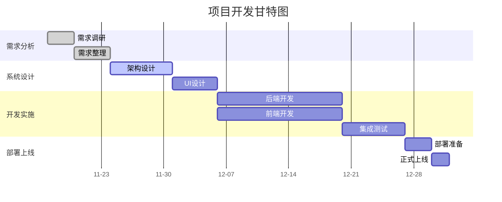

<div class="plan-header">

# 🚀 AI生成的开发计划

<div class="meta-info">

**⏰ 生成时间：** 2025-11-10 09:59:19  
**🤖 AI模型：** Qwen2.5-72B-Instruct  
**💡 基于用户创意智能分析生成**  
**🔗 Agent应用MCP服务增强**

</div>

</div>

---

### 学生信息管理系统开发计划

#### 1. 产品概述
学生信息管理系统是一个Web应用程序，旨在帮助学校管理人员高效地管理学生信息。系统提供了学生信息的增、删、改、查功能，并支持管理员和学生的不同权限。系统将部署在Vercel上，使用Neon数据库进行数据存储，并确保数据的安全性和系统的可用性。

#### 2. 技术方案

##### 2.1 系统架构设计
采用经典的 HTML、CSS、JavaScript 技术架构来实现系统。后端基于 Neon 的云数据库实现，通过 Vercel 的 Serverless Functions 进行数据交互。

##### 2.2 技术栈
- **前端**：HTML、CSS、JavaScript
- **后端**：无传统后端，后端全部基于 Neon 的云数据库实现
- **数据库**：Neon
- **部署**：Vercel

##### 2.3 数据库设计
- **学生表**：包含学生的基本信息，如学号、姓名、性别、年龄、班级、专业等。
- **管理员表**：包含管理员的基本信息，如用户名、密码。

##### 2.4 系统流程

**1. 管理员登录**：管理员输入用户名和密码，系统验证后进入学生信息管理界面。


**2. 学生信息管理**：管理员可以查看所有学生的信息，也可以进行增加、删除、修改和查询操作。


**3. 学生信息查询**：学生输入学号和密码登录，跳转到学生信息页面，可以查看本学生的信息。


#### 3. 开发计划

##### 3.1 需求分析
- **需求调研**：收集和整理用户需求，明确系统功能和非功能需求。
- **需求整理**：编写详细的需求文档，确保所有需求都被准确记录。

##### 3.2 系统设计
- **架构设计**：设计系统整体架构，确定技术选型和模块划分。
- **UI设计**：设计用户界面，确保界面友好、操作简便。

##### 3.3 开发实施
- **后端开发**：实现 Vercel 的 Serverless Functions，连接 Neon 数据库，实现数据增、删、改、查功能。
- **前端开发**：开发前端页面，实现用户登录、注册、学生信息管理等功能。
- **集成测试**：进行系统集成测试，确保各模块正常工作。

##### 3.4 部署上线
- **部署准备**：配置 Vercel 环境变量，确保数据库连接字符串正确。
- **正式上线**：将系统部署到 Vercel，进行最后的测试和优化。

##### 3.5 项目时间表


#### 4. 部署方案
- **环境配置**：在 Vercel 中配置环境变量，包括数据库连接字符串 `DATABASE_URL` 和其他必要的配置。
- **数据库初始化**：使用 Neon 数据库的初始结构，创建学生表和管理员表，并预置一个默认管理员账号（用户名：admin，密码：admin）。
- **代码部署**：将项目代码推送到 Vercel，自动构建并部署到生产环境。

#### 5. 推广策略
- **内部培训**：对学校管理人员进行系统使用培训，确保他们能够熟练操作。
- **用户手册**：编写详细的用户手册，提供系统使用指南。
- **反馈机制**：建立用户反馈机制，及时收集和处理用户意见和建议。

### 总结

以上是完整的开发计划和技术方案。

---


<div class="prompts-highlight">

# 🤖 AI编程助手提示词

> 💡 **使用说明**：以下提示词基于您的项目需求定制生成，可直接复制到 GitHub Copilot、ChatGPT、Claude 等AI编程工具中使用


#### 1. 登录注册功能开发提示词


```
请为学生信息管理系统开发登录注册功能。

项目背景：
学生信息管理系统是一个Web应用程序，旨在帮助学校管理人员高效地管理学生信息。系统提供了学生信息的增、删、改、查功能，并支持管理员和学生的不同权限。系统将部署在Vercel上，使用Neon数据库进行数据存储，并确保数据的安全性和系统的可用性。

功能要求：
1. 学生可以注册登录系统；
2. 管理员可以通过输入用户名和密码进行登录；
3. 密码需要加密存储（如 bcrypt）；
4. 无需验证码和邮箱验证；
5. 无注册登录的外部服务。

技术约束：
- 使用 HTML、CSS、JavaScript
- 后端基于 Vercel 的 Serverless Functions 实现
- 数据库使用 Neon
- 访问 Neon 数据库的方式：在 Vercel 上实现 Serverless Functions（使用环境变量安全地连接 Neon）；
- 管理员账号是需要预置一个默认账号（用户名：admin，密码：admin）

输出要求：
- 完整可运行代码
- 详细注释说明
- 错误处理机制
- 测试用例
```


#### 2. 学生信息管理功能开发提示词


```
请为学生信息管理系统开发学生信息管理功能。

项目背景：
学生信息管理系统是一个Web应用程序，旨在帮助学校管理人员高效地管理学生信息。系统提供了学生信息的增、删、改、查功能，并支持管理员和学生的不同权限。系统将部署在Vercel上，使用Neon数据库进行数据存储，并确保数据的安全性和系统的可用性。

功能要求：
1. 管理员可以查看所有学生的信息；
2. 管理员可以对学生信息进行增加、删除、修改和查询操作；
3. 学生可以登录后查看本人信息；
4. 系统要能正确处理中文，不能出现乱码；
5. 要求有人性化的用户界面设计。

技术约束：
- 使用 HTML、CSS、JavaScript
- 后端基于 Vercel 的 Serverless Functions 实现
- 数据库使用 Neon
- 访问 Neon 数据库的方式：在 Vercel 上实现 Serverless Functions（使用环境变量安全地连接 Neon）；
- 管理员账号是需要预置一个默认账号（用户名：admin，密码：admin）

输出要求：
- 完整可运行代码
- 详细注释说明
- 错误处理机制
- 测试用例
```


#### 3. 用户界面设计开发提示词


```
请为学生信息管理系统设计用户界面。

项目背景：
学生信息管理系统是一个Web应用程序，旨在帮助学校管理人员高效地管理学生信息。系统提供了学生信息的增、删、改、查功能，并支持管理员和学生的不同权限。系统将部署在Vercel上，使用Neon数据库进行数据存储，并确保数据的安全性和系统的可用性。

功能要求：
1. 登录界面：管理员输入用户名、密码进行登录；
2. 注册界面：学生输入用户名、密码进行注册；
3. 学生信息管理界面：管理员可以查看所有学生的信息，也可以进行增加、删除、修改和查询操作；
4. 学生信息查询：学生输入学号和密码登录，跳转到学生信息页面，可以查看本学生的信息；
5. 要求有人性化的用户界面设计；
6. 界面需要统一的移动优先响应式布局。

技术约束：
- 使用 HTML、CSS、JavaScript
- 后端基于 Vercel 的 Serverless Functions 实现
- 数据库使用 Neon
- 访问 Neon 数据库的方式：在 Vercel 上实现 Serverless Functions（使用环境变量安全地连接 Neon）；
- 管理员账号是需要预置一个默认账号（用户名：admin，密码：admin）

输出要求：
- 完整可运行代码
- 详细注释说明
- 错误处理机制
- 测试用例
```


#### 4. 数据库设计开发提示词


```
请为学生信息管理系统设计数据库结构。

项目背景：
学生信息管理系统是一个Web应用程序，旨在帮助学校管理人员高效地管理学生信息。系统提供了学生信息的增、删、改、查功能，并支持管理员和学生的不同权限。系统将部署在Vercel上，使用Neon数据库进行数据存储，并确保数据的安全性和系统的可用性。

功能要求：
1. 学生表：包含学生的基本信息，如学号、姓名、性别、年龄、班级、专业等；
2. 管理员表：包含管理员的基本信息，如用户名、密码；
3. 管理员账号是需要预置一个默认账号（用户名：admin，密码：admin）；
4. 系统要能正确处理中文，不能出现乱码。

技术约束：
- 使用 Neon 数据库
- 访问 Neon 数据库的方式：在 Vercel 上实现 Serverless Functions（使用环境变量安全地连接 Neon）；
- 密码需要加密存储（如 bcrypt）。

输出要求：
- 完整可运行代码
- 详细注释说明
- 错误处理机制
- 测试用例
```


#### 5. 集成测试开发提示词


```
请为学生信息管理系统编写集成测试用例。

项目背景：
学生信息管理系统是一个Web应用程序，旨在帮助学校管理人员高效地管理学生信息。系统提供了学生信息的增、删、改、查功能，并支持管理员和学生的不同权限。系统将部署在Vercel上，使用Neon数据库进行数据存储，并确保数据的安全性和系统的可用性。

功能要求：
1. 管理员可以查看所有学生的信息；
2. 管理员可以对学生信息进行增加、删除、修改和查询操作；
3. 学生可以登录后查看本人信息；
4. 系统要能正确处理中文，不能出现乱码；
5. 要求有人性化的用户界面设计。

技术约束：
- 使用 HTML、CSS、JavaScript
- 后端基于 Vercel 的 Serverless Functions 实现
- 数据库使用 Neon
- 访问 Neon 数据库的方式：在 Vercel 上实现 Serverless Functions（使用环境变量安全地连接 Neon）；
- 管理员账号是需要预置一个默认账号（用户名：admin，密码：admin）

输出要求：
- 完整可运行代码
- 详细注释说明
- 错误处理机制
- 测试用例
```


### 技术栈对比表格

| 技术栈 | 优点 | 缺点 |
| --- | --- | --- |
| HTML/CSS/JavaScript | 前端开发成熟，易于上手 | 功能有限，复杂应用需要更多框架支持 |
| Vercel | 部署简单，支持Serverless | 免费版有使用限制 |
| Neon | 云端数据库，易于扩展 | 新技术，社区支持相对较少 |

### 项目里程碑时间表

| 里程碑 | 日期 | 描述 |
| --- | --- | --- |
| 需求调研 | 2025-11-17 | 收集和整理用户需求 |
| 需求整理 | 2025-11-21 | 编写详细的需求文档 |
| 架构设计 | 2025-11-28 | 设计系统整体架构 |
| UI设计 | 2025-12-03 | 设计用户界面 |
| 后端开发 | 2025-12-17 | 实现 Vercel 的 Serverless Functions |
| 前端开发 | 2025-12-17 | 开发前端页面 |
| 集成测试 | 2025-12-24 | 进行系统集成测试 |
| 部署准备 | 2025-12-27 | 配置 Vercel 环境变量 |
| 正式上线 | 2025-12-29 | 将系统部署到 Vercel |

### 架构图


```
flowchart TD
    A["用户界面"]  -->  B["前端逻辑"]
    B  -->  C[Vercel Serverless Functions]
    C  -->  D[Neon Database]
    C  -->  E[Session Management]
    F["缓存"]  -->  C
```


### 流程图


```
flowchart TD
    Start([开始])  -->  Login[管理员登录]
    Login  -->  Validate{验证用户名和密码}
    Validate  --> |有效| AdminPage[学生信息管理界面]
    Validate  --> |无效| Error[显示错误]
    AdminPage  -->  Add[增加学生信息]
    AdminPage  -->  Delete[删除学生信息]
    AdminPage  -->  Update[修改学生信息]
    AdminPage  -->  Query[查询学生信息]
    StudentLogin[学生登录]  -->  ValidateStudent{验证学号和密码}
    ValidateStudent  --> |有效| StudentPage[学生信息页面]
    ValidateStudent  --> |无效| Error
    StudentPage  -->  View[查看个人信息]
    Error  -->  Login
    Error  -->  StudentLogin
```


### 甘特图


```
gantt
    title 项目开发甘特图
    dateFormat YYYY-MM-DD
    axisFormat %m-%d
    
    section 需求分析
    需求调研     :done, req1, 2025-11-17, 3d
    需求整理     :done, req2, after req1, 4d
    
    section 系统设计
    架构设计     :active, design1, after req2, 7d
    UI设计       :design2, after design1, 5d
    
    section 开发实施
    后端开发     :dev1, after design2, 14d
    前端开发     :dev2, after design2, 14d
    集成测试     :test1, after dev1, 7d
    
    section 部署上线
    部署准备     :deploy1, after test1, 3d
    正式上线     :deploy2, after deploy1, 2d
```


</div>
